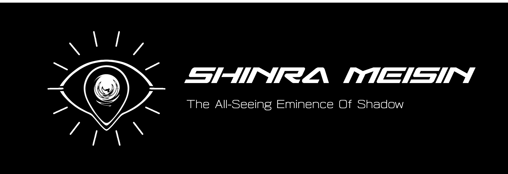
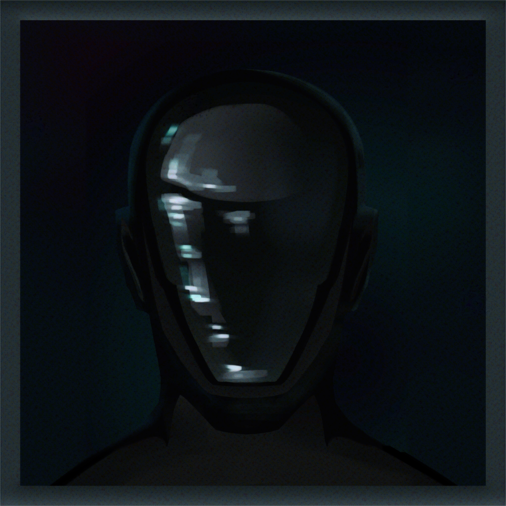
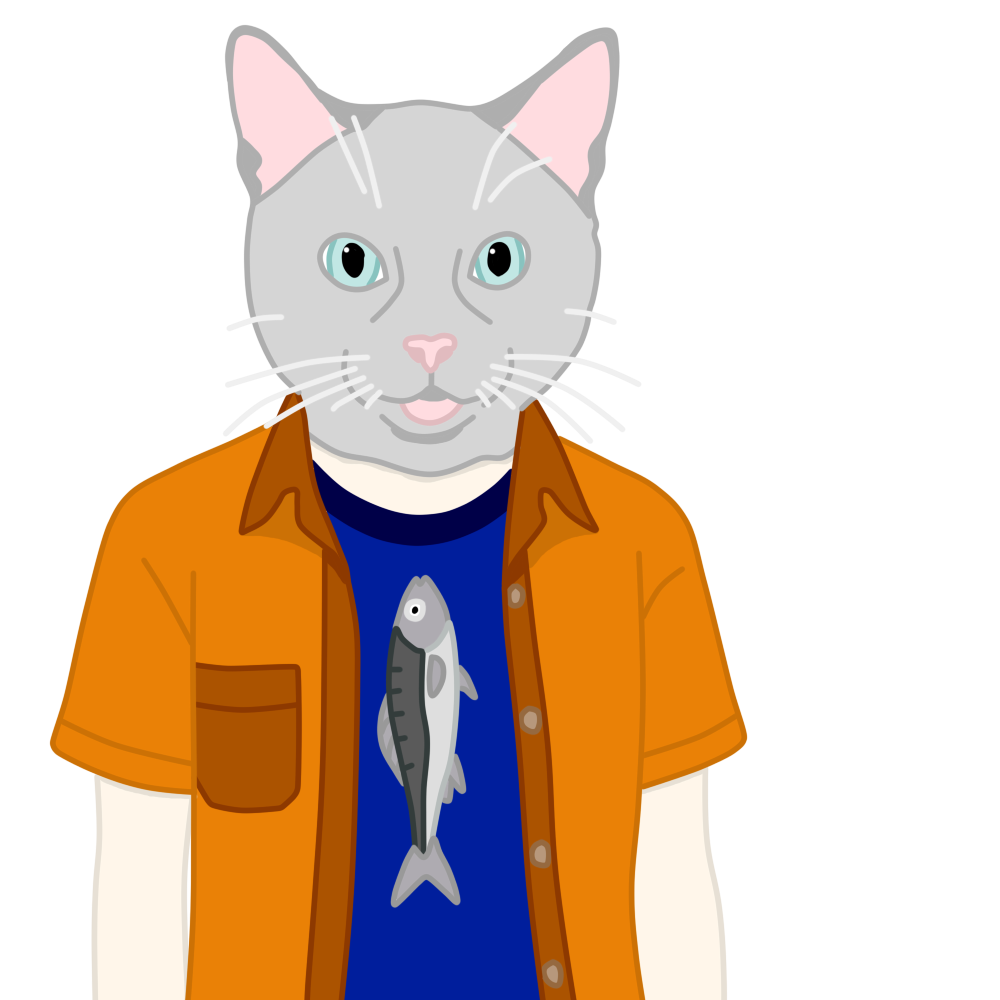

# The Shinra Meisin
### *神羅明眸 — "The All-Seeing Eminence Of Shadow"*

**A Modular Tracking System Created For VR/AR Headsets and Human Computer Interfaces

The Shinra-Meisin is an open-source tracking pipeline built by Walker Industries R&D in partnership with EOZVR. It’s meant to handle eye tracking, mouth tracking, SLAM-based spatial mapping, inside-out full-body tracking, and BCI input in one extensible system.

It started as the tracking stack for the Vector Gear XR headset (planned for February 2027), but it’s grown into something bigger: a toolkit for developers who want low-level control without giving up user privacy or flexibility.

The Shinra-Meisin connects to other programs through OSC and/or [Eclipse](https://github.com/Walker-Industries-RnD/Eclipse/), a free forever project bringing security and speed for app to app systems.

  <strong>Windows • Linux • macOS • Fully Offline • Auto Save • No BS</strong>

 

 

|  |  |  |
|---|---|---|
| **Project Lead - WalkerDev** “Loving coding is the same as hating yourself” [Discord](https://discord.gg/H8h8scsxtH) | **Art - Kennaness** “When will I get my isekai?” [Bluesky](https://bsky.app/profile/kennaness.bsky.social) • [ArtStation](https://www.artstation.com/kennaness) | **Eye Tracking System Lead - John** “I cant think of a quote you can leave it alone for now” |

 

  <a href="https://github.com/Walker-Industries-RnD/shinra-meisin/"><strong>View on GitHub</strong></a> •
  <a href="https://walkerindustries.xyz">Walker Industries</a> •
  <a href="https://discord.gg/H8h8scsxtH">Discord</a>

  <a href="https://walker-industries-rnd.github.io/shinra-meisin/welcome.html" 
     style="font-size: 1.4em; color: #58a6ff; text-decoration: none;">
    <strong> Documentation • Examples • Design </strong>
  </a>

---

## Demo 1 - Eye Tracker

---
## Development Checklist

### Core Tracking Systems

| Module                               | Purpose                            | Status |
| ------------------------------------ | ---------------------------------- | ------ |
| [[1. Understanding The Eye Tracker]] | Gaze + calibration                 | 🟡     |
| Mouth Tracking                       | Facial motion / expression mapping | 🔵     |
| SLAM Spatial Mapping                 | Environment reconstruction         | 🔵     |
| Inside-Out FBT                       | Inside-out body inference          | 🔴     |
| BCI Integration Layer                | Neural/signal input pipeline       | 🔴     |
### Supplementary Systems

| Module                 | Purpose                           | Status |
| ---------------------- | --------------------------------- | ------ |
| Eclipse - Zenoh Update | Handles Realtime Data             | 🔵     |
| [[Work In Progress]]   | Windows (x64) + Linux (x64 / ARM) | 🔵     |
| SDKs                   | Unity And Godot SDK               | 🔴     |

- 🟢 Stable / functional - This works and is ready for production
- 🟡 Updates pending / partially working - This works but isn't production ready (yet)
- 🔵 In progress / unstable - A prototype is being developed and will soon be showcased
- 🔴 Concept / R&D stage - This topic will be started up after the completion of a prerequisite.

---

## Why open source

Reliable eye tracking has been locked behind expensive proprietary hardware for too long. The model architecture, the training pipeline, and the synthetic-data tooling should be something the community can build on. The plug-and-play hardware product funds the research. The research belongs to everyone.

---
## License & Artwork

Copyright (c) 2026 Walker Industries R&D. All rights reserved.

The Shinra Meisin is currently source-available during active R&D.  

A full release is planned once the platform architecture, documentation, and SDK examples are stable enough for external usage.

> Read more here: https://github.com/Walker-Industries-RnD/Malicious-Affiliation-Ban/

**Artwork:** © Kennaness — **NO AI training. NO reproduction. NO exceptions.**

> Unauthorized use of the artwork — including but not limited to copying, distribution, modification, or inclusion in any machine-learning training dataset — is strictly prohibited and will be prosecuted to the fullest extent of the law.

 
